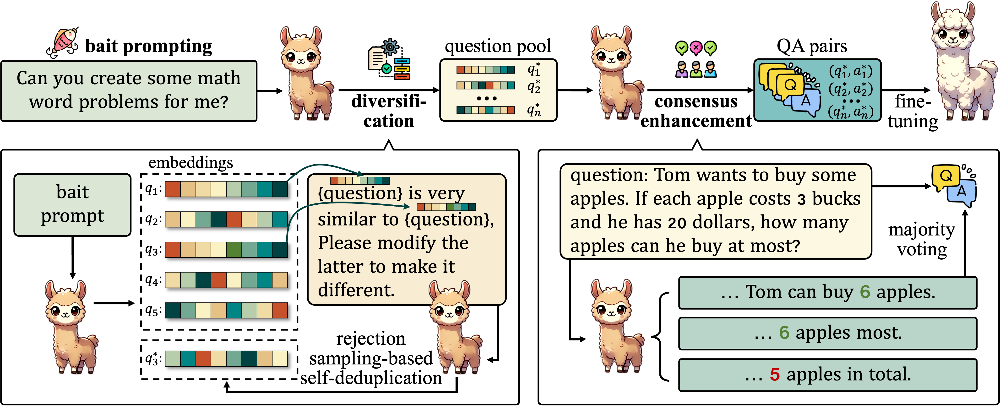

# Crescent



This repository contains the implementation for "The Self-Improvement Paradox: Can Language Models Bootstrap Reasoning Capabilities without External Scaffolding?". Below are the instructions to reproduce our results.

## 📋 Table of Contents
- [Installation](#installation)
- [Data Generation](#data-generation)
- [Fine-tuning](#fine-tuning)
- [Evaluation](#evaluation)
- [Citation](#citation)

## ⚙️ Installation
```bash
pip install -r requirements.txt
```

## 🧠 Data Generation
The `scripts/` directory contains two data generation scripts:
- `generate_llama2.py`: Uses **Llama-2-7B-Chat** for data generation
- `generate_llama3.py`: Uses **Llama-3-8B-Instruct** for mathematical data generation

Pre-generated datasets are available on Hugging Face: (Coming soon...)

## 🎯 Fine-tuning
We use [Open-Instruct](https://github.com/allenai/open-instruct) for model fine-tuning. Complete training parameters can be found in Section 3.1 of our paper.

## 📊 Evaluation
Evaluation is performed using the [lm-evaluation-harness](https://github.com/EleutherAI/lm-evaluation-harness):


## 📜 Citation
If you find this work useful, please cite our paper:
```bibtex
@article{sun2025self,
  title={The Self-Improvement Paradox: Can Language Models Bootstrap Reasoning Capabilities without External Scaffolding?},
  author={Sun, Yutao and Chen, Mingshuai and Zhao, Tiancheng and Xu, Ruochen and Zhang, Zilun and Yin, Jianwei},
  journal={arXiv preprint arXiv:2502.13441},
  year={2025}
}
```
